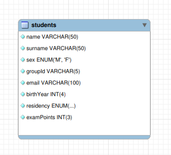

# Student list pet-project

## Basic endpoints:

### 1. Page with registered students(main page)

* Drop-down list with registered students

* Search

### 2. Form to register a student

## Database design and API

API is described with [**swagger**](https://github.com/memeEnjoyer/student-list.git/swagger.yaml).
